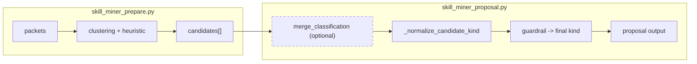
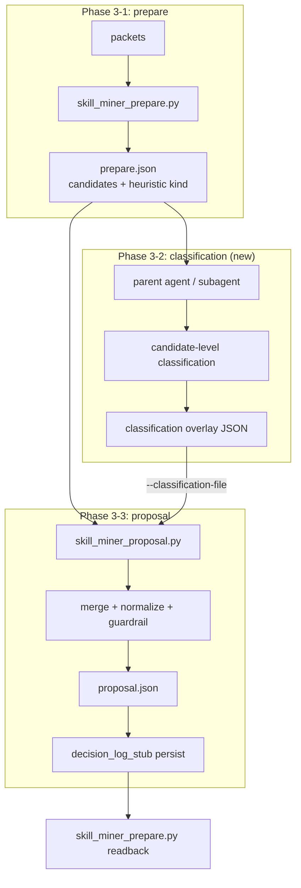

# Priority 4 Classification Refresh Plan

## Summary

`skill-miner` の分類は現在 Python heuristic 中心だが、`--classification-file` による LLM overlay の受け口と Python guardrail はすでに実装済みである。残る主要課題は、`classification overlay` を誰がどう生成するか、`decision_key` に `suggested_kind` が含まれるため分類変更でキーがドリフトする問題、そして `daytrace-session` の Phase 3 に分類ステップを組み込む導線の 3 点である。

本計画では、LLM 呼び出しは script 内に埋め込まず、`daytrace-session` を実行している親エージェントまたはその子サブエージェントが classification overlay を生成する方針を取る。Python script は deterministic な `prepare / proposal / guardrail / carry-forward` に集中させ、段階的に 3 フェーズで移行する。

## Current State

- `infer_suggested_kind_details()` が heuristic による 4 分類を行う
- `skill_miner_proposal.py --classification-file` で candidate 単位の classification overlay を受け取れる
- `_normalize_candidate_kind()` が `heuristic -> llm -> guardrail` の順で最終 `suggested_kind` を確定する
- `classification_trace` と `suggested_kind_source` は proposal JSON に残る
- `daytrace-session` から classification overlay を自動生成する導線はまだ無い
- carry-forward / suppress の readback は `skill_miner_prepare.py` 側が担っている

## Target Flow

### Design Decisions

- LLM 呼び出しは script 外で行う
  - 親エージェントまたは子サブエージェントが overlay を生成する
- overlay は candidate 単位で 1 file = 1 candidate とする
- triage (`ready / needs_research / rejected`) は当面 `prepare` の heuristic を維持する
- heuristic 分類は fallback と guardrail 入力として残す
- guardrail は Phase 1 では変更しない

## Phase 1: Classification Step Integration

### Goal

`daytrace-session` の Phase 3 で、`prepare` 後・`proposal` 前に classification overlay を自動生成できるようにする。

### Scope

1. `classification-prompt.md` を追加する
2. `daytrace-session` に `prepare -> classify -> proposal` の導線を追加する
3. malformed / missing overlay に対する fallback テストを補強する

### Work Items

1. `plugins/daytrace/skills/skill-miner/references/classification-prompt.md` を新規作成
   - 入力フィールド定義
   - 出力 JSON contract
   - 4 分類の定義
   - few-shot 例 2-3 件
2. `plugins/daytrace/skills/daytrace-session/SKILL.md` の Phase 3 更新
   - prepare 後に classification ステップを追加
   - 親エージェントまたは子サブエージェントが候補ごとに overlay を作る
   - `skill_miner_proposal.py --classification-file ...` に全 overlay を渡す
3. `plugins/daytrace/skills/skill-miner/SKILL.md` の Pre-Classification Contract 更新
   - subagent 前提の生成経路を明記
4. `tests/test_skill_miner_proposal.py` のテスト追加
   - overlay なし -> heuristic fallback
   - malformed overlay -> graceful fallback
   - optional: low-confidence overlay の期待値を固定

### Files

- [classification-prompt.md](/Users/makotomatuda/projects/lab/daytrace/plugins/daytrace/skills/skill-miner/references/classification-prompt.md)
- [daytrace-session/SKILL.md](/Users/makotomatuda/projects/lab/daytrace/plugins/daytrace/skills/daytrace-session/SKILL.md)
- [skill-miner/SKILL.md](/Users/makotomatuda/projects/lab/daytrace/plugins/daytrace/skills/skill-miner/SKILL.md)
- [test_skill_miner_proposal.py](/Users/makotomatuda/projects/lab/daytrace/tests/test_skill_miner_proposal.py)

### Not Changing Yet

- Python script 内への LLM 呼び出し実装
- guardrail ロジック
- `decision_key`

## Phase 2: Carry-Forward Stabilization

### Goal

分類変更が起きても carry-forward / suppress が壊れないように、`decision_key` とは別に安定した `content_key` を導入する。

### Important Correction

carry-forward の readback は `skill_miner_proposal.py` ではなく `skill_miner_prepare.py` が担う。したがって、二段マッチ導入の主戦場は `prepare` 側である。

### Scope

1. `content_key` を導入する
2. `prepare` 側で `decision_key -> content_key` の二段マッチを行う
3. proposal persist row に `content_key` を追加する
4. migration ケースのテストを追加する

### Work Items

1. `build_candidate_content_key()` を追加
   - `label + intent_trace[:2] + constraints[:2] + acceptance_criteria[:2]`
   - `suggested_kind` は含めない
2. `build_candidate_decision_stub()` に `content_key` を追加
3. `skill_miner_proposal.py` の persist row に `content_key` を書く
4. `skill_miner_prepare.py` の readback を二段化
   - 一次: `decision_key` 完全一致
   - 二次: `content_key` 一致 + kind 違い
   - 二次マッチ時は `classification_migrated` を付ける
5. contract / state machine doc 更新
6. テスト追加
   - same content, different kind
   - same content, same kind
   - content mismatch

### Files

- [skill_miner_common.py](/Users/makotomatuda/projects/lab/daytrace/plugins/daytrace/scripts/skill_miner_common.py)
- [skill_miner_prepare.py](/Users/makotomatuda/projects/lab/daytrace/plugins/daytrace/scripts/skill_miner_prepare.py)
- [skill_miner_proposal.py](/Users/makotomatuda/projects/lab/daytrace/plugins/daytrace/scripts/skill_miner_proposal.py)
- [proposal-json-contract.md](/Users/makotomatuda/projects/lab/daytrace/plugins/daytrace/skills/skill-miner/references/proposal-json-contract.md)
- [carry-forward-state-machine.md](/Users/makotomatuda/projects/lab/daytrace/plugins/daytrace/skills/skill-miner/references/carry-forward-state-machine.md)
- [test_skill_miner_proposal.py](/Users/makotomatuda/projects/lab/daytrace/tests/test_skill_miner_proposal.py)
- [test_skill_miner.py](/Users/makotomatuda/projects/lab/daytrace/tests/test_skill_miner.py)
- [skill_miner_gold.json](/Users/makotomatuda/projects/lab/daytrace/tests/fixtures/skill_miner_gold.json)

## Phase 3: Guardrail and Prompt Quality Improvements

### Goal

実運用データを見ながら、guardrail と classification prompt の精度を上げる。

### Scope

1. `agent / CLAUDE.md / hook` の境界改善
2. confidence の扱い見直し
3. few-shot と境界ケースの蓄積

### Work Items

1. guardrail 条件の拡張
   - `agent` 向け role consistency signal
   - `CLAUDE.md` 向け declarative ratio
   - `hook` は false positive コストが高いため慎重に拡張
2. prompt 改善
   - override / revert パターンを few-shot に反映
3. confidence の扱い検討
   - Phase 3 までは分岐導入を保留し、まず観測する

### Files

- [skill_miner_common.py](/Users/makotomatuda/projects/lab/daytrace/plugins/daytrace/scripts/skill_miner_common.py)
- [classification.md](/Users/makotomatuda/projects/lab/daytrace/plugins/daytrace/skills/skill-miner/references/classification.md)
- [classification-prompt.md](/Users/makotomatuda/projects/lab/daytrace/plugins/daytrace/skills/skill-miner/references/classification-prompt.md)
- [test_skill_miner_proposal.py](/Users/makotomatuda/projects/lab/daytrace/tests/test_skill_miner_proposal.py)

### Status（実装済み）

- **script**: `agent` 用 **role consistency**（`label`+`intent_trace` の 2 行以上が役割語一致）、`CLAUDE.md` 用 **declarative weight / ratio**（artifact なしでも制約・受け入れから許可）、`hook` 用 **狭いゲート**（`run_tests` 先頭 + `tests-before-close` + 観測回数；評価順で `HOOK_RULE_INDICATORS` と衝突しないよう先に評価）
- **観測**: `ready[]` に `classification_guardrail_signals`（`llm_confidence` はエコーのみ、guardrail 分岐は不変）
- **docs**: `classification.md` / `classification-prompt.md`（few-shot 例 4–5）/ `proposal-json-contract.md` / `SKILL.md`
- **tests**: `test_skill_miner_proposal.py` に上記 3 系統の回帰テスト

## Risks

- `decision_key` drift
  - 深刻度: 高
  - 軽減策: Phase 2 の `content_key` 二段マッチ
- LLM の非決定性
  - 深刻度: 中
  - 軽減策: heuristic fallback と guardrail を維持
- 初版 prompt の品質不足
  - 深刻度: 中
  - 軽減策: overlay 無しでも現状維持できる構造を保つ
- 候補数増加時のコスト
  - 深刻度: 低
  - 軽減策: `ready + needs_research` を優先し、`rejected` は原則 classify しない

## Open Questions

- classification は親エージェントが直接行うか、専用サブエージェントへ委譲するか
  - 暫定方針: まず親エージェント
- `content_key` の構成要素は十分か
  - 暫定方針: `label + intent_trace + constraints + acceptance_criteria`
- `classification_trace` を decision log に永続化するか
  - 暫定方針: まずは proposal output のみ
- confidence で guardrail を変えるか
  - 暫定方針: まずは全 confidence で同一 guardrail

## Smallest Next Step

`plugins/daytrace/skills/skill-miner/references/classification-prompt.md` を作成する。

理由:

- Python script の追加変更が不要
- 現在の overlay 受け皿をそのまま活かせる
- `daytrace-session` の Phase 3 更新に先立って、入出力 contract を固定できる
- 親エージェント実行と子サブエージェント委譲のどちらにも使い回せる
