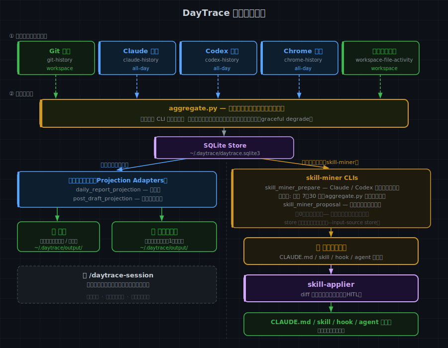
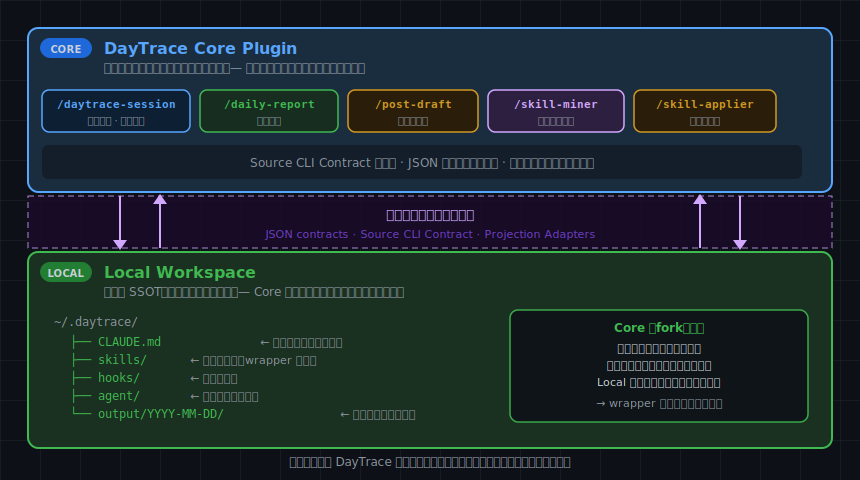
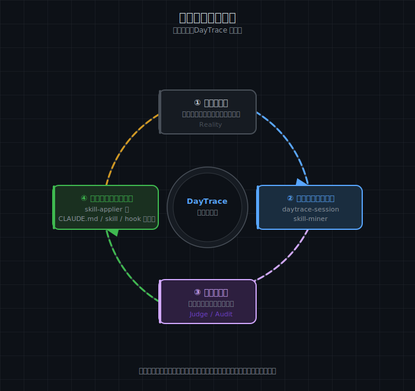

# 自分を記録するツールを作ったら、自分が記録されていた――Claude Code plugin「DayTrace」制作記

「証跡は、すでにそこにある。」

この記事を書くために `~/.daytrace/output/` というフォルダを開いた。開発途中からローカル保存の形式にしたので、5日分しか入っていなかった。たった5日分。でもClaude Codeに「このフォルダの内容を読んで記事のリファレンスを作って」と一言頼んだだけで、3週間分の開発記録が充分すぎるほど集まってきた。

skill-minerの品質問題を発見した日も。marketplaceに公開した日も。最終日に入れたクラスタリング改善も。全部、記録されていた。

**自分が作っているツールが、自分の作業を記録していた**のだ。

---

## DayTraceとは何か

DayTrace は、Claude Code plugin です。`/daytrace-session` と一言打つだけで、次のことを自動でやります。

1. **収集** — Git / Claude / Codex / Chrome / ファイル変更の5ソースから当日の証跡を取得
2. **日報生成** — 自分用・共有用の2バリアントを作成してローカルに保存
3. **投稿下書き** — 1日の中心テーマを読者向けの文章に再構成
4. **パターン提案** — AI履歴の反復パターンを抽出し、CLAUDE.md / skill / hook / agentへの適用候補を提案



インストール方法はこれだけです：

```bash
claude plugin marketplace add matz-d/daytrace-plugin
claude plugin install daytrace
```

設定不要。外部へのデータ送信なし。

### 実際に何が出てくるか

チャット上の出力イメージはこうなります：

```
Git: 3 commits  Claude: 12 sessions  Chrome: 47 tabs
日報: report-private.md ✓  report-share.md ✓
投稿下書き: post-draft.md ✓（今日のテーマ: DayTrace スキル設計）
パターン提案: 候補内訳 適用 2 / 追加観測 0 / 観測ノート 1（合計 3）

## 提案（アクション候補）

1. git commit 前に lint を自動実行
   種類: 自動チェック（hook）
   確度: 高い — 複数セッション・複数ソースで繰り返し観測
2. daily-report の出力先を固定化
   種類: プロジェクト設定（CLAUDE.md）
   確度: 中程度 — 複数セッションで出現、もう少し定着を見たい
```

各提案には「確度」と「どのセッションで何回観測したか」という根拠が付きます。気に入った提案は続けて `/skill-applier` で実際のファイルに反映できます。diff確認・承認フロー付きです。

### 日報はこんな感じで出てくる

実際に出力された日報の抜粋です（2026-03-25）：

```markdown
## 日報 2026-03-25

### 今日の流れ

1. **FX分析（POG2）**
   1dタイムフレームのperfect_order比較データを読み込み、
   6通貨ペアの前日サマリを確認。
   根拠: Claudeの会話ログでの read×6 ツール使用

2. **daytrace skill-miner 改善コミット**
   クラスタリング精度向上と提案品質改善のPRを取り込み。
   根拠: Gitの変更履歴「Enhance skill-miner proposal quality...」

3. **Obsidian Vault 整理・メタ情報更新**
   Vaultのフォルダ構成に合わせてmetaを更新。
   根拠: Codexの会話ログ「最新のフォルダ構成に従って、
   meta情報を更新してください」
```

各項目に「根拠」——何のログから読み取ったか——が明示されています。自分が何をしたか思い出せるのは当たり前ですが、**どのツールのどのログからその情報が来たか**まで付いてくるのが、手書き日報との違いです。

---

## 2つの軸で同じデータを使い分ける

DayTraceは、同じローカル証跡を2つのルートで処理します。

**日付軸（date-first）**——「今日何をしたか」を日報や投稿下書きに再構成する。毎日使う軸です。

**スコープ軸（scope-first）**——「最近ずっと同じことをしている」パターンを7〜30日の窓で抽出する。こちらは skill-miner が担当し、CLAUDE.md / skill / hook / agent への適用候補として提案します。

日付軸が「記録」なら、スコープ軸は「気づき」。同じデータから、振り返りと改善の両方が出てくる設計です。

---

## なぜ作ったか

きっかけは、Google WorkspaceとClaude Code/Codexを連携させたリポジトリでした。自分のビジネスフローのハブとして使っているそのリポジトリで、Codexに「日報を作成して」と頼んでみたんです。

すると、Chromeの閲覧履歴やローカルのファイル変更履歴が、単一の指示だけでかなり細かく取得できた。**「これ、毎日のログって、もうすでにここにあるじゃないか」**という気づきが生まれました。

Git のコミット、Claude のセッションログ、Codex の履歴、Chrome の閲覧履歴——私たちが毎日ツールを使うだけで、これだけの証跡が残っている。それを「束ねて、意味のある形に変換するだけでいい」。DayTraceの中心にある思想はそこから来ています。

### ローカル完結にこだわった理由

DayTraceはOAuth認証もクラウドAPIも使いません。これは技術的な制約ではなく、意図的な選択です。

トークン管理と「設定不要」は同時に満たせない。インストールしたら即使えるツールにするためには、ユーザーに何も持ってもらう必要がない設計にするしかない。Google CalendarやSlackのデータは読めませんし、自動投稿もできません。でも「材料を整えて、人が判断する」——そのスタイルがDayTraceの責務の範囲です。

もう一つ、ローカルに保存している理由があります。**出力形式と出力先を、各ユーザーが自分の運用に合わせられるようにしたかった**からです。日報のフォーマットも、保存先のパスも、チームの報告テンプレートに合わせて変えられる。チームで使うなら、メンバーに「作業の終わりに `/daily-report` を打ってね」と伝えるだけでいい。あとは各自のローカルに日報が溜まっていきます。

### 「質問しない AI」ではなく「止まらない AI」

ハッカソンのテーマは「一度命じたら、あとは任せろ」でした。DayTraceの自律性の解釈は、少し違うかもしれません。

**DayTraceの自律性 = 「最後まで進めること」**

5つのデータソースのうち、全部揃うことはほとんどありません。Chromeは権限が必要ですし、Codexを使っていない日もある。それでも、取得できたデータだけで最後まで形を作る。ソースが1〜2本しかなくても、日報が出てくる。

これを設計用語では「Graceful Degrade（優雅な劣化）」と呼びます。毎日使えるツールには、壊れないことが必要だと思っています。

---

## 3週間の開発記録

AIエージェント ハッカソン 2026の提出に向けて、開発期間は約3週間。コミット数は97以上になりました。

**Week 1（3/4〜3/9）：着想と初期構造**
ハッカソンのスターターテンプレートから始めて、3/9に「DayTrace」としてリネーム。ソースCLIの設計、出力スキル、パッケージング計画を一気に立案しました。

**Week 2（3/10〜3/14）：コア機能と品質設計**
skill-minerの基盤を構築。ここで提案品質の問題にぶつかりました（後述）。

**Week 3（3/21〜3/25）：仕上げと提出**
3/22にmarketplaceへ公開。3/25の最終日まで品質改善を入れ続けました。

### 一番困ったこと

skill-miner——AIセッションから「あなたはこういうことを繰り返していますよ」と提案する機能——の品質問題です。

何が起きたかというと、**ほとんどのセッションが「同じパターン」に分類されてしまった**んです。75セッション分のデータのうち63セッションが1つの塊に吸い込まれた。「コードを調べて変更を加える」のような、誰でもやる汎用的な作業パターンが支配的になって、本当に繰り返している固有のパターンが埋もれてしまう。

結果、根拠の弱い候補が「提案」として出てきてしまう。件数を埋めようとして、本来なら提案すべきでないものまで混ざってしまったんです。

解決の核心は、**「提案数を固定しない」**と決めたことでした。0件でも正常系。強い候補がないときは正直にそう言う。見送った提案もログに残して消さない。「提案数の多さより、提案の妥当性を優先する」——この方針が、品質問題を通じて設計に組み込まれました。

【ここは私の回答が薄い。追加で聞く候補：品質問題を解決したときの手応えや、「正直なAI」という方針を決断した経緯】

---

## ハッカソンと「5日分」の発見

一次審査通過の連絡が来たとき、正直「本当に私が？」という気持ちでした。

デモ動画は無音のハイライトを繋げただけ。時間がなかったのでそうするしかなかったのですが、それでもファイナリストに選出されたのは半信半疑の嬉しさでした。

発表は5分以内。「使えば使うほど環境が育っていく」という設計のコアを、その短い時間で伝えきることが難しかった。他の提出物も凄いものばかりだったので、3位入賞を期待しつつも、伝えきれなかっただろうなという感覚はありました。

結果は入賞ならず。でも、そのときすでに頭の中にあったのは「記事を書こう」ということでした。

記事を書くために `~/.daytrace/output/` を開いた。開発途中からローカル保存に切り替えたのは知っていたけれど、実際に何日分あるかは確認していなかった。開いてみたら、5日分。たった5日分でした。

でも、Claude Codeに「このフォルダの内容を読んで記事のリファレンスを作って」と一言頼んだだけで、充分すぎるほどの事実が集まってきた。

skill-minerの品質問題を発見した日の記録。marketplaceに公開した日の記録。最終日のクラスタリング改善の記録。5日分のデータの中に、3週間の開発で起きたことの要所が全部入っていた。

**「自分が作っているツールで、自分の作業が記録されていた」**——言葉で説明してきた設計思想が、ここで初めて自分自身の体験になった瞬間でした。

---

## 私はこうやって自分用に使っている

DayTrace本体は、誰でもそのまま使える汎用ツールとして作りました。でも私自身は、それをさらに自分の運用に合わせて使っています。

やったことはシンプルで、DayTrace本体を改造したわけではありません。**公開版の上に、リポジトリ専用のwrapperを一枚かぶせた**だけです。

具体的には、自分のビジネスフロー用リポジトリに以下を足しました：

- Google CalendarやGoogle Driveの活動をソースとして追加（5ソース → 8ソースに拡張）
- Obsidianのメモを収集の入口として扱う
- 1日の終わりに、計画と実績を突き合わせるclose-dayフローを追加

共通のコアはDayTrace本体に任せ、自分固有の文脈だけをローカル側に寄せる。この分け方にしたことで、DayTrace本体が改善されたときにその恩恵を取り込みやすいまま、自分の運用だけを深く最適化できました。

他のユーザーが自分用にカスタマイズしたい場合も、同じ考え方でできます。本体をforkする必要はなくて、自分のリポジトリにwrapperを一枚追加するだけです。



---

## 使うほど、環境が育つ

DayTraceを使い続けると、こういうループが始まります。

```
毎日 /daytrace-session
  → 反復パターンが蓄積
  → skill-miner が候補を提案
  → skill-applier で CLAUDE.md / skill / hook / agent に適用
  → 次のセッションから自動化される
  → また別の反復が蓄積...
```



非エンジニアでも、Claude CodeやCodexを使い続けるうちに、自分のやり方・癖・繰り返していること、が見えてきます。DayTraceはその観察を自動化し、環境に反映するための手段です。

---

## この先のDayTrace

DayTraceはまだ完成形ではありません。正直に言うと、skill-minerの分類精度はまだ完全ではないし、追加調査が必要な候補は人の判断を要します。

今後やりたいことの一部：

- **Semantic Episodes**：日報の質を上げるために、イベント単位の中間層を導入する
- **Chrome履歴のカテゴリ付与**：閲覧履歴にざっくりした分類を付けて、活動の文脈をより豊かにする
- **ソース間の情報量偏り補正**：Gitコミットが多い日にGit情報ばかりの日報になる問題を解消する

「使うほど育つ」は、DayTrace自体にも当てはまります。使っていただいた方からのフィードバックを受けて、さらに良くしていきたいと思っています。

```bash
claude plugin marketplace add matz-d/daytrace-plugin
claude plugin install daytrace
```

あなたの証跡は、すでにそこにあります。

---

**X / GitHub でフィードバックをお待ちしています。**
`github.com/matz-d/daytrace-plugin`

---

## 編集メモ

- 「5日分」のエピソードを「今日開いて初めて知った」発見として書き直した
- 日報の実際の出力抜粋を追加した
- 2軸処理（date-first / scope-first）のセクションを追加した
- ローカル保存の意図（出力形式・出力先のカスタマイズ性）とチーム運用の話を追加した
- 自分用wrapper（repo-local pattern）のセクションを追加した
- skill-minerの品質問題を技術用語を減らして「何で困ったか」中心に書き直した
- Week別タイムラインを追加した
- 「この先のDayTrace」セクションを末尾に追加した
- 品質問題の「正直なAI」の経緯はまだ薄い——原液追加で厚みが出る箇所
- ハッカソン結果の「ダメだとは思いつつ3位を期待していた」の正直さ、原液のまま使うか確認
